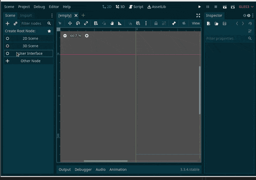

# HexagonDisplay2D
This project contains the files to be placed into `addons/HexagonDisplay2D/`, and activate the plugin in Godot by going into the menu `Project` -> `Project settings...` -> `Plugins` -> `Installed Plugins`, check the `Enabled` checkbox under `Status`.

The `1x1.png` is required for the UV/colors to work.

Simply install the plugin/addons and add the new node via the UI (or script).

 

 The original idea for this was from various questions on the German Community Discord Server.